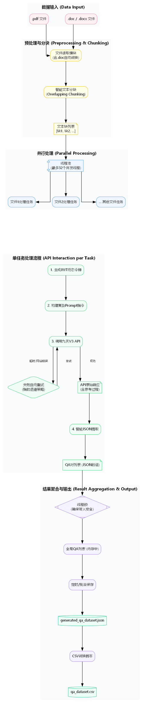
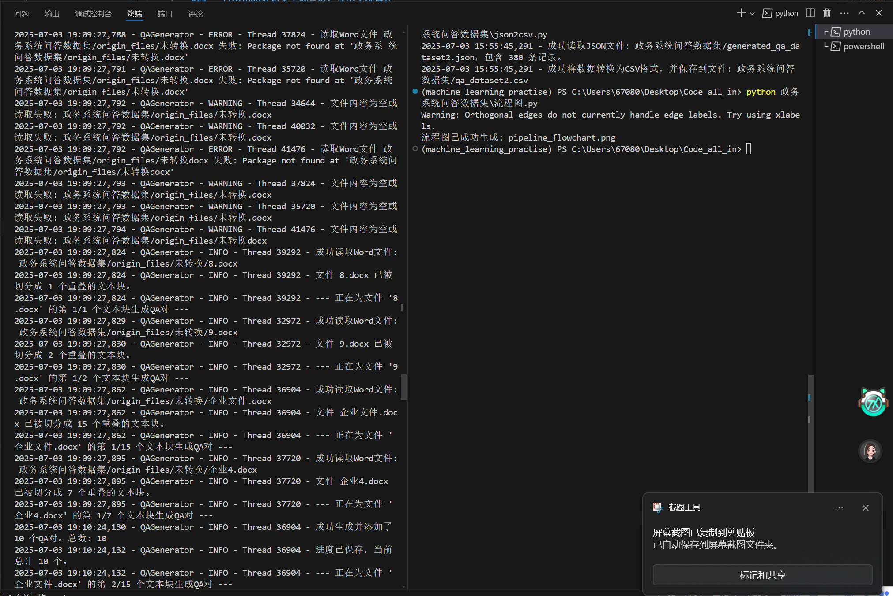
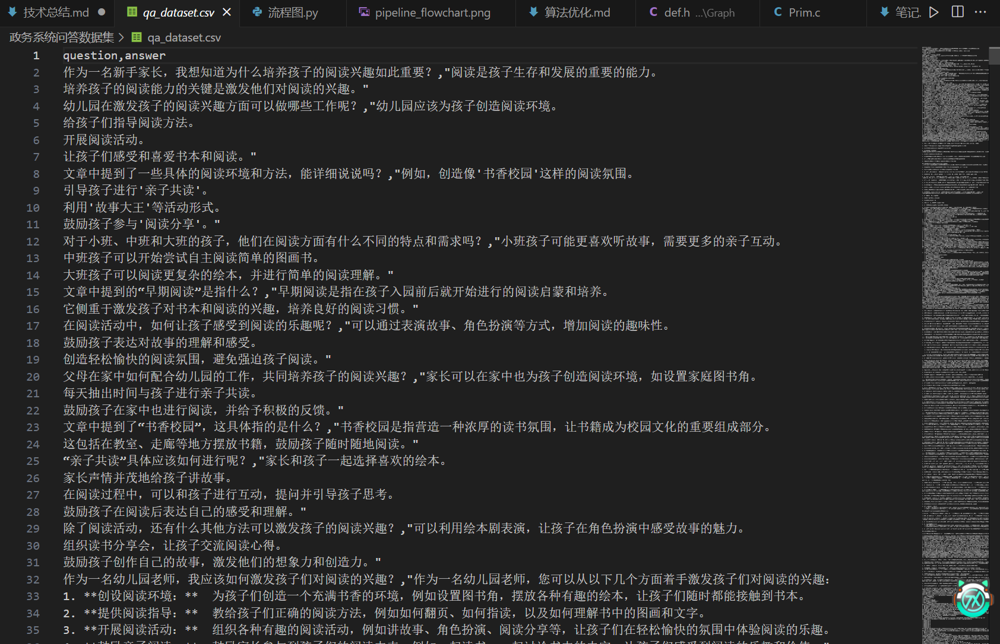
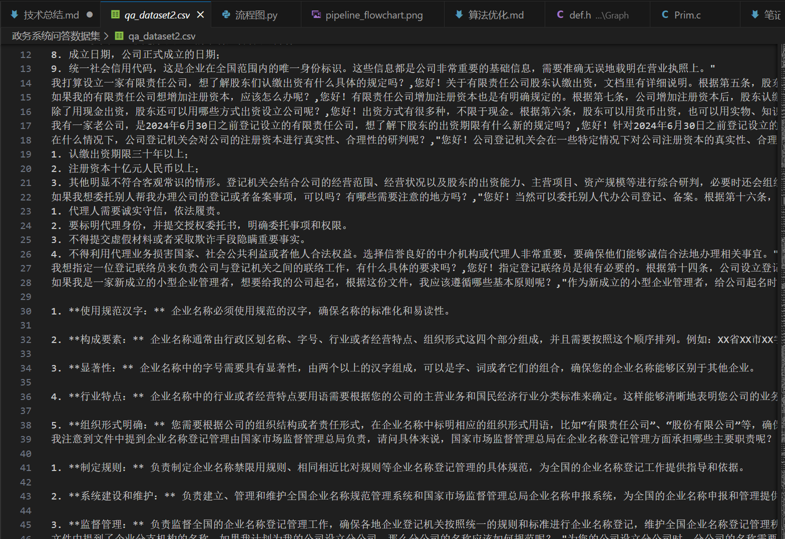
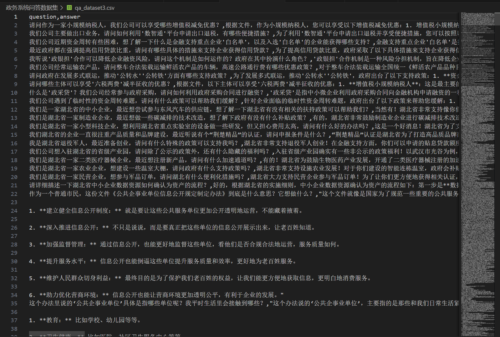

### **自动化QA数据集生成管道：技术实现概述**

为满足从多种格式的非结构化文档中，批量、高效地生成高质量、结构化问答(QA)数据集的需求，我设计并实现了一套自动化的数据处理与生成管道。该管道的核心是利用大型语言模型（LLM）的自然语言理解与生成能力，并通过一系列工程技术确保流程的稳定性、可扩展性和鲁棒性。

**核心技术栈与组件：**

* **编程语言与环境**: Python 3.x
* **API交互**: `requests`库用于执行与九天大模型V3 API (`/api/v3/chat/completions`)的HTTP POST通信。
* **安全认证**: 采用`PyJWT`库实现符合官方规范的JWT (JSON Web Token)动态令牌生成。通过HS256算法，将API Key的ID和Secret部分与时间戳和有效期结合，为每次API请求生成一个有时效性的Bearer Token，确保了通信的安全性。
* **多格式文档解析**:
    * **PDF处理**: 利用`PyPDF2`库从`.pdf`文件中提取纯文本内容。
    * **Word文档处理**:
        * 使用`python-docx`库直接解析现代`.docx`文件。
        * 为兼容老旧的`.doc`格式，通过`pywin32`库调用Windows COM接口，在后台启动Microsoft Word应用程序，以编程方式将`.doc`文件无损转换为`.docx`格式，从而实现对多种Word文档的无缝处理。
* **并行处理与并发控制**:
    * 为了最大化处理效率，引入了`concurrent.futures.ThreadPoolExecutor`，构建了一个可配置（最多32个）工作线程的线程池，实现了对多个源文件的并行处理。
    * 为确保在多线程环境下对共享数据（最终的QA列表和输出文件）的写入操作是原子性的，使用了`threading.Lock`机制，有效防止了竞态条件和数据损坏。
* **数据处理与解析**:
    * **智能文本分块 (Overlapping Chunking)**: 为解决因`prompt`过长导致的API网关超时（504 Gateway Time-out）问题，设计并实现了带有重叠区域的文本分块策略。将长文档切分为固定大小（如2500字符）的文本块，并让相邻块之间有部分内容重叠（如200字符），这在保证每次API请求轻量化的同时，最大程度地维持了上下文的连续性，保障了生成质量。
    * **健壮的JSON提取**: 针对LLM可能返回非纯净JSON（例如，包含其“思考过程”的文本）的情况，利用正则表达式(`re`)和字符串查找(`find`/`rfind`)方法，实现了一个智能解析器。该解析器能从混杂的文本中精确地提取出由`[`...`]`或`{`...`}`包裹的核心JSON内容，极大地增强了系统的容错能力。
* **错误处理与稳定性**:
    * **自动重试机制**: 在API调用函数中集成了带有指数退避策略的重试循环。当遇到网络波动、服务器临时超时等可恢复性错误时，脚本会自动等待一个逐渐加长的时间后重试（最多4次），显著提升了长时间、大批量任务的成功率。
    * **全面的日志系统**: 使用`logging`模块，将详细的运行日志（包括线程信息、API响应、错误详情等）同时输出到控制台和本地日志文件，为监控、调试和问题追溯提供了坚实的基础。

**最终成果:**

通过上述技术的综合应用，最终交付的是一个高效、稳定且可扩展的Python脚本。它能够：
1.  并行处理包含`.pdf`, `.docx`, `.doc`等多种格式的大批量文件。
2.  自动、安全地完成与九天V3 API的认证和通信。
3.  通过智能分块和上下文重叠技术，在保证生成质量和避免API超时的矛盾中取得了最佳平衡。
4.  利用精心设计的`prompt`工程，引导模型生成符合特定场景、特定格式（包括对流程图的文字描述）的高质量QA对。
5.  最终将所有生成的QA对聚合，并保存为结构化的`.json`和`.csv`文件，便于后续的数据分析、模型训练或知识库构建。

**最终生成的CSV数据集文件示例**

该方案不仅完成了预定任务，还在工程实践的多个层面（如并发、容错、数据解析）进行了优化，形成了一套可复用的、用于大规模语言模型数据工程的解决方案。